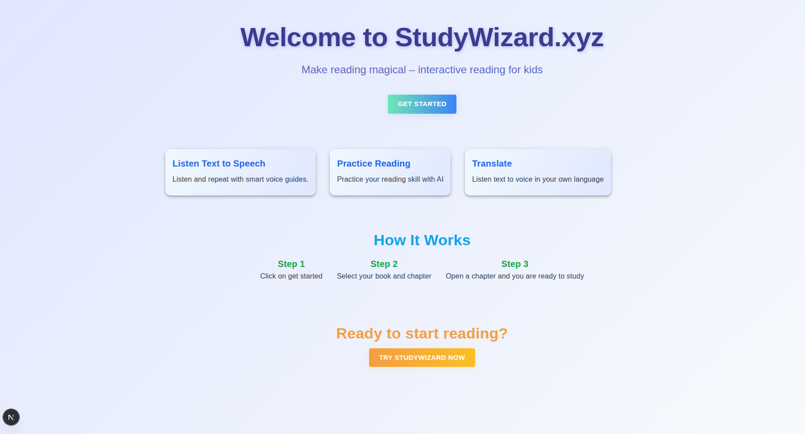
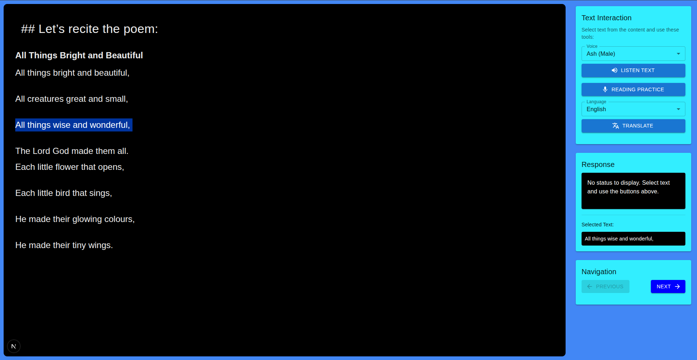

# 📚 Kids Reading Practice webapp with AI





---

Create `.env` file in `server` directory

```bash
OPENAI_API_KEY='<Your openai api key here>'

# Your fastapi API url
server_base_url = 'http://localhost:8000'

```

---

How to start nextjs client server

Run the following command from `client` directory

```bash
npm install
npm run dev
```

Then, Open `http://localhost:3000` in your browser to view the app.
